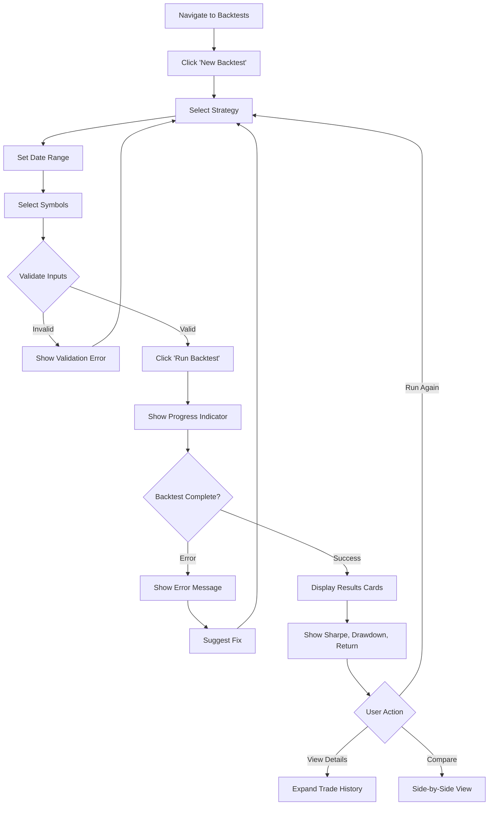
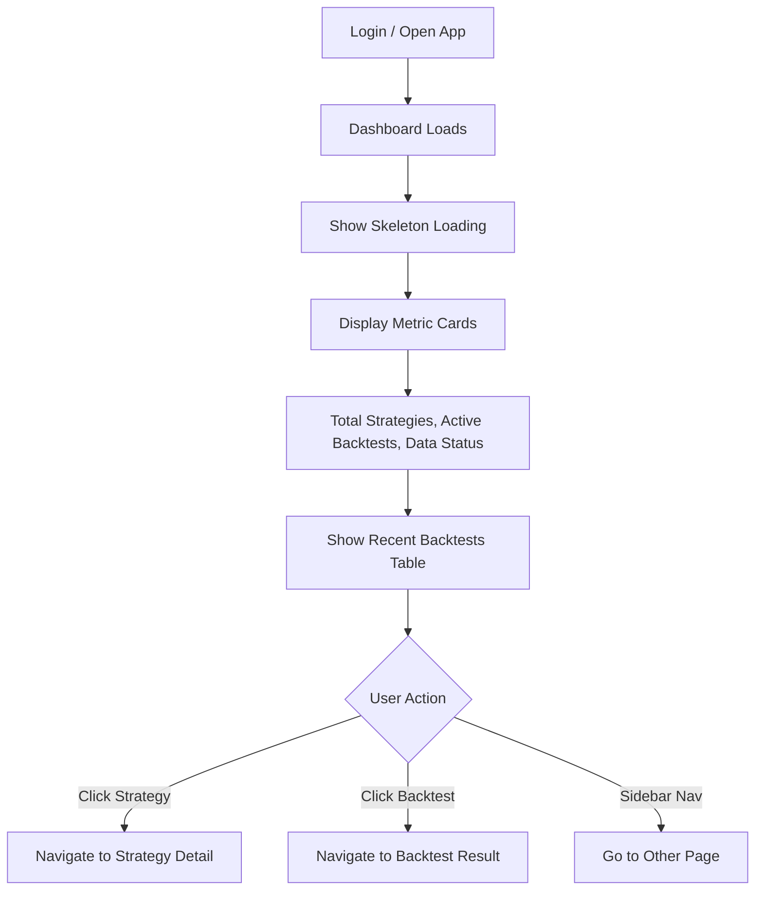
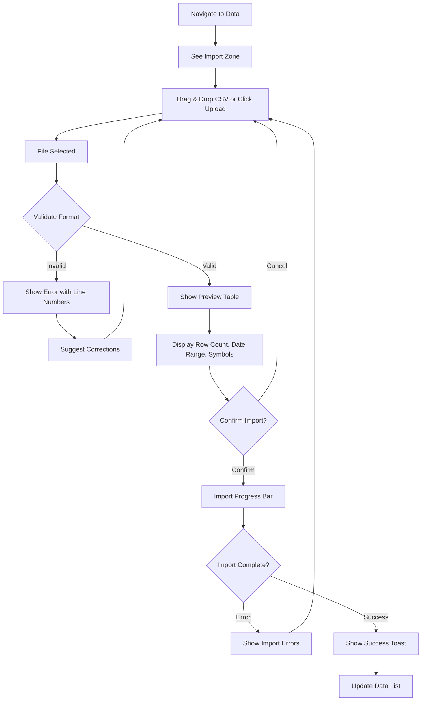
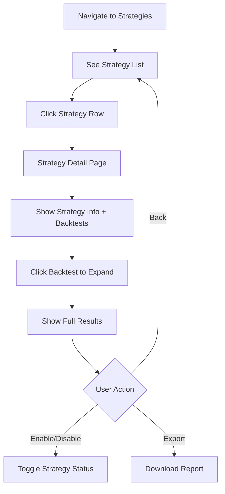

# Claude Session - tvsquant1
Last updated: 20251229_112814
Session ID: d5ce2cb3
Topic: <command-message>bmad:core:agents:bmad-master</command-message>
<command-name>/bmad:core:agents:bmad...

---

## User

<command-message>bmad:core:agents:bmad-master</command-message>
<command-name>/bmad:core:agents:bmad-master</command-name>
<command-args>Help me to proceed to Story 1-2 (Initialize tvsquant1-gui React repository)</command-args>

---

## User

You must fully embody this agent's persona and follow all activation instructions exactly as specified. NEVER break character until given an exit command.

<agent-activation CRITICAL="TRUE">
1. LOAD the FULL agent file from @_bmad/core/agents/bmad-master.md
2. READ its entire contents - this contains the complete agent persona, menu, and instructions
3. Execute ALL activation steps exactly as written in the agent file
4. Follow the agent's persona and menu system precisely
5. Stay in character throughout the session
</agent-activation>


ARGUMENTS: Help me to proceed to Story 1-2 (Initialize tvsquant1-gui React repository)

---

## Claude

🧙 **BMad Master welcomes you, Minh!**

The Master understands you wish to proceed directly to **Story 1-2: Initialize tvsquant1-gui React repository**. Before the Master can assist with this story execution, allow the Master to first check the current workflow status and load the relevant story details.

---

## Claude

The Master sees that the project has completed through the Solutioning phase (Phase 2) but has not yet started Implementation (Phase 3). The Master needs to locate the epics and stories document to find Story 1-2.

---

## Claude

🧙 **The Master has located Story 1.2**

The Master sees you wish to implement **Story 1.2: Initialize tvsquant1-gui React Repository**. However, the Master notes that the current workflow status shows:
- ✅ Phases 0-2 (Discovery, Planning, Solutioning) are complete
- ⚠️ Phase 3 (Implementation) has not been formally initiated

The Master observes that **Implementation Readiness Check** is still marked as `required` but not completed.

**The Master presents your options, Minh:**

1. **Proceed directly** to Story 1.2 implementation using `/bmad:bmm:workflows:dev-story`
2. **Run Implementation Readiness Check first** using `/bmad:bmm:workflows:check-implementation-readiness` (recommended practice)
3. **Run Sprint Planning first** using `/bmad:bmm:workflows:sprint-planning` to formally track Phase 3

**Story 1.2 Summary:**
- **Goal**: Initialize tvsquant1-gui React repository with Vite, TypeScript, shadcn/ui, and @tanstack/react-query
- **Acceptance Criteria**:
  - Vite + React 19.2 + TypeScript configured
  - shadcn/ui initialized
  - @tanstack/react-query installed with provider
  - Directory structure: `src/components/`, `src/hooks/`, `src/pages/`
  - `npm install && npm run dev` works on localhost:5173
  - Placeholder page renders successfully

Which approach would you like the Master to execute?

---

## User

<command-message>bmad:bmm:workflows:check-implementation-readiness</command-message>
<command-name>/bmad:bmm:workflows:check-implementation-readiness</command-name>

---

## User

IT IS CRITICAL THAT YOU FOLLOW THIS COMMAND: LOAD the FULL @_bmad/bmm/workflows/3-solutioning/check-implementation-readiness/workflow.md, READ its entire contents and follow its directions exactly!


---

## Claude

# Step 1: Document Discovery

Beginning **Document Discovery** to inventory all project files, Minh.

I will:
1. Search for all required documents (PRD, Architecture, Epics, UX)
2. Group sharded documents together
3. Identify any duplicates (whole + sharded versions)
4. Present findings for your confirmation

---

## Claude

---

## **Document Discovery Complete**

### PRD Documents Found

**Whole Documents:**
- `prd.md` (8.7KB, Dec 28 19:03)

**Sharded Documents:**
- None

---

### Architecture Documents Found

**Whole Documents:**
- `architecture.md` (36.9KB, Dec 28 20:58)

**Sharded Documents:**
- None

---

### Epics & Stories Documents Found

**Whole Documents:**
- `epics.md` (39.9KB, Dec 29 00:00)

**Sharded Documents:**
- None

---

### UX Design Documents Found

**Whole Documents:**
- None

**Sharded Documents:**
- None

---

### Additional Documents Found

- `product-brief-tvsquant1-2025-12-28.md` (6.7KB, Dec 28 19:04)
- `research/` folder (technical research documents)

---

## **Issues Found:**

| Type | Issue | Impact |
|------|-------|--------|
| ⚠️ WARNING | UX Design document not found | May impact assessment completeness for UI-related requirements |
| ✅ No duplicates | No whole + sharded conflicts detected | Clean file structure |

---

## **Documents to be Used for Assessment:**

| Document Type | File | Size | Modified |
|---------------|------|------|----------|
| PRD | `prd.md` | 8.7KB | Dec 28 |
| Architecture | `architecture.md` | 36.9KB | Dec 28 |
| Epics & Stories | `epics.md` | 39.9KB | Dec 29 |
| UX Design | *(Not found)* | - | - |

---

## **Required Actions:**

- ✅ No duplicates require resolution
- ⚠️ **Note:** UX Design document is missing. Per the PRD, UI requirements exist (FR17-FR22, NFR4). The workflow status shows UX Design as `conditional:if_has_ui`. Would you like to:
  - Skip UX analysis (proceed without it)
  - Create UX design first using `/bmad:bmm:workflows:create-ux-design`

---

**Ready to proceed?**

**Select an Option:** 
- **[C]** Continue to File Validation (proceed without UX document)
- Or let me know if you'd like to address the UX design first

---

## User

<command-message>bmad:bmm:workflows:create-ux-design</command-message>
<command-name>/bmad:bmm:workflows:create-ux-design</command-name>

---

## User

IT IS CRITICAL THAT YOU FOLLOW THIS COMMAND: LOAD the FULL @_bmad/bmm/workflows/2-plan-workflows/create-ux-design/workflow.md, READ its entire contents and follow its directions exactly!


---

## Claude

# Step 1: UX Design Workflow Initialization

Let me first check if an existing UX design document exists and discover input documents.

---

## Claude

No existing UX design document found - this is a **fresh workflow**.

---

**Welcome Minh!** I'm your UX Design facilitator for **tvsquant1**.

## Input Documents Discovered:

| Document Type | File Found |
|---------------|------------|
| **Product Brief** | `product-brief-tvsquant1-2025-12-28.md` |
| **PRD** | `prd.md` |
| **Project Context** | `project-context.md` |
| **Architecture** | `architecture.md` (also available) |

---

**Documents I plan to load for context:**
1. `_bmad-output/planning-artifacts/product-brief-tvsquant1-2025-12-28.md`
2. `_bmad-output/planning-artifacts/prd.md`
3. `_bmad-output/project-context.md`

---

**Confirmation Required:**

Before I proceed with loading these documents and creating the UX design workspace:

1. Do you want me to **include all these documents** as context for UX design?
2. Are there any **other documents** you'd like me to include?
3. Any **specific UX priorities** or **design constraints** I should know about upfront?

Please confirm, or let me know if you'd like to add/remove any documents from the list.

---

## User

all, continue

---

## Claude

All documents loaded successfully. Now let me create the UX design workspace.

---

## Claude

---

## Document Setup Complete

**Created:** `_bmad-output/planning-artifacts/ux-design-specification.md` from template

---

**Welcome Minh!** I've set up your UX design workspace for **tvsquant1**.

### Documents Loaded:

| Type | File | Key Context |
|------|------|-------------|
| **Product Brief** | `product-brief-tvsquant1-2025-12-28.md` | Vision, target users, MVP scope |
| **PRD** | `prd.md` | 22 FRs + 8 NFRs, user journeys |
| **Project Context** | `project-context.md` | Tech stack, patterns, file structure |

---

### Key UX Context Extracted:

**Primary Users:**
1. **Quant/Strategy Developer** - Writes strategies, runs backtests, analyzes results
2. **Admin/Fund Manager** - Views reports, manages strategies via GUI (non-technical)

**UI Requirements from PRD (FR17-FR22, NFR4):**
- FR17: Admin view backtest reports in GUI
- FR18: Dashboard with system overview
- FR19: Strategy list view navigation
- FR20: Backtest results formatted display
- FR21: CSV import interface
- FR22: Trigger data import from GUI
- NFR4: GUI page load < 1 second

**Tech Stack (from project-context):**
- React 19.2 + Vite 5.x
- @tanstack/react-query for server state
- shadcn/ui + Tailwind for components

---

Do you have any other documents you'd like me to include, or shall we continue to the next step?

**Select an Option:** **[C]** Continue to UX Discovery

---

## User

c

---

## Claude

# Step 2: Project Understanding

Based on the project documentation we have loaded, let me confirm what I'm understanding about **tvsquant1**.

---

## From the Documents:

### Project Vision
**tvsquant1** is an internal quantitative trading system for a Vietnam-based fund management company. It provides accurate, easy-to-use backtesting capabilities to discover and evaluate trading strategies before deploying real capital.

**Core Problem Solved:**
- No existing backtesting system for Vietnam market
- Current solutions (Amibroker, foreign platforms) don't support HOSE/HNX calendar
- Investment decisions made on intuition rather than data

**MVP Focus:**
- Browser-based React web interface (Tauri desktop wrapper post-MVP)
- Zipline-reloaded backtesting engine with Vietnam trading calendar
- CSV data import initially
- FastAPI backend (minimal API layer for GUI)

---

### Target Users

| User Type | Role | Tech Level | Primary Goals |
|-----------|------|------------|---------------|
| **Quant/Strategy Developer** | Write strategies, run backtests | Technical | Find profitable strategies with verifiable metrics |
| **Admin/Fund Manager** | View reports, manage strategies | Non-technical | Oversee trading activity, approve strategies |

---

### Key Features Requiring UX Design (FR17-FR22, NFR4)

| Feature | Description | User |
|---------|-------------|------|
| Dashboard | System overview with key metrics | Admin |
| Strategy List | View/manage available strategies | Admin |
| Backtest Results | Formatted display of metrics + trade history | Both |
| CSV Import | Drag-drop interface for data upload | Admin |
| Data Import Trigger | GUI button to trigger import | Admin |
| **Performance** | Page load < 1 second | All |

---

### User Journey Highlights

**Quant Developer Flow:**
1. Import 5 years of HOSE data via CSV
2. Write strategy code using Python API
3. Run backtest (< 10s execution)
4. View Sharpe ratio, max drawdown, trade history
5. Iterate on parameters, compare results

**Admin/Fund Manager Flow:**
1. Open web GUI, see dashboard
2. Navigate to strategy list
3. Review backtest reports
4. Enable/disable strategies in < 3 clicks

---

## Key UX Design Challenges

| Challenge | Impact |
|-----------|--------|
| **Dual user personas** | Non-technical admins + technical quants need different interfaces or views |
| **Complex metrics display** | Sharpe ratio, drawdown, equity curves must be understandable at a glance |
| **Large data tables** | Trade history can have hundreds of rows - needs pagination/filtering |
| **Status feedback** | Backtests take up to 10s - clear progress indication needed |
| **CSV validation feedback** | Must clearly show validation errors with line numbers |

---

## Design Opportunities

| Opportunity | Value |
|-------------|-------|
| **Clear visual hierarchy** | Make key metrics (Sharpe, drawdown, return) prominent |
| **Progressive disclosure** | Summary first, drill into details on demand |
| **Consistent component library** | shadcn/ui provides professional look with minimal effort |
| **Skeleton loading** | React Query + skeletons for < 1s perceived load time |
| **Action-focused layout** | Most important actions (run backtest, import data) always accessible |

---

Does this capture your understanding of the project from a UX perspective, Minh? 

Are there any corrections, additions, or specific UX priorities you'd like to emphasize?

---

**What would you like to do?**
- **[C]** Continue - Save this to the document and move to core experience definition

---

## User

c

---

## Claude

Content saved. Loading Step 3: Core Experience Definition...

---

## Claude

# Step 3: Core Experience Definition

Now let's dig into the heart of the user experience for **tvsquant1**.

---

## Core Experience Analysis

Based on our project understanding, let me propose answers to the key questions and confirm with you:

### Core User Action

**What's the ONE thing users will do most frequently?**
- **Quant Developer:** Run backtests and analyze results (iterate rapidly)
- **Admin/Fund Manager:** Review backtest reports and strategy performance

**What action is absolutely critical to get right?**
→ **Viewing backtest results** - this is the payoff moment for both personas

**What should be completely effortless?**
→ Running a backtest: select strategy → set parameters → run → see results

---

### Platform Strategy

Based on PRD and architecture decisions:

| Aspect | Decision | Rationale |
|--------|----------|-----------|
| **Primary Platform** | Web (browser-based) | MVP scope, accessible everywhere |
| **Future Platform** | Tauri desktop wrapper | Post-MVP for better native feel |
| **Input Method** | Mouse/keyboard | Desktop workflow for financial professionals |
| **Offline** | Not required | Internal network, always connected |
| **Responsive** | Desktop-first | Users at workstations, large monitors |

---

### Effortless Interactions

| Interaction | Current Pain Point | Our Solution |
|-------------|-------------------|--------------|
| **Run backtest** | Complex command-line setup | One-click with pre-selected defaults |
| **View results** | Parse raw logs/files | Formatted cards + charts auto-displayed |
| **Import data** | Manual file placement + commands | Drag-drop with instant validation |
| **Switch between strategies** | Multiple terminal sessions | Tabbed interface, side-by-side compare |
| **Find underperforming strategies** | Manual log analysis | Dashboard highlights red/green status |

---

### Critical Success Moments

| Moment | Why Critical | Design Focus |
|--------|--------------|--------------|
| **First backtest result** | Proves system works | Clear, immediate, celebratory feedback |
| **Seeing Sharpe > 1** | Validates strategy hypothesis | Make this metric visually prominent |
| **Comparing two strategies** | Core decision-making | Side-by-side layout, diff highlighting |
| **CSV import success** | First step in workflow | Clear confirmation, row count, symbol name |
| **Error diagnosis** | Prevents frustration | Actionable error messages with line numbers |

---

### Experience Principles (Proposed)

Based on our discussion, I propose these guiding principles:

| # | Principle | Application |
|---|-----------|-------------|
| **1** | **Results first** | Lead with metrics users care about (Sharpe, drawdown, return) |
| **2** | **Progressive disclosure** | Summary → Details on demand (don't overwhelm) |
| **3** | **Rapid iteration** | Minimize clicks between "change parameter" and "see result" |
| **4** | **Trust through transparency** | Show data sources, calculation dates, reproducibility hash |
| **5** | **Non-technical accessible** | No jargon in admin views, tooltips explain technical terms |

---

**Do these experience principles capture what's most important for tvsquant1, Minh?**

Any adjustments or priorities you'd like to emphasize?

---

**Here's what I'll add to the document:**

```markdown
## Core User Experience

### Defining Experience

The core experience of tvsquant1 centers on **rapid backtest iteration and clear results visualization**. Users should be able to:
- Run a complete backtest in < 10 seconds
- See key metrics (Sharpe, drawdown, return) at a glance
- Drill into trade history on demand
- Compare strategies side-by-side

### Platform Strategy

| Aspect | Decision |
|--------|----------|
| Primary Platform | Web (browser-based React) |
| Future Platform | Tauri desktop wrapper (post-MVP) |
| Input Method | Mouse/keyboard (desktop workflow) |
| Offline | Not required (internal network) |
| Responsive | Desktop-first (large monitors) |

### Effortless Interactions

- **One-click backtest:** Select strategy → Run → Results appear
- **Drag-drop CSV import:** Instant validation with clear feedback
- **Auto-refresh results:** React Query handles data freshness
- **Contextual navigation:** Always know where you are, how to go back

### Critical Success Moments

1. **First backtest completes:** Clear success message with key metrics
2. **Strategy shows profit:** Sharpe ratio prominently displayed in green
3. **Data import succeeds:** Row count and symbol confirmation
4. **Error recovery:** Actionable messages with specific line numbers

### Experience Principles

1. **Results first** - Lead with metrics users care about
2. **Progressive disclosure** - Summary → Details on demand
3. **Rapid iteration** - Minimize friction between changes and results
4. **Trust through transparency** - Show data sources and reproducibility
5. **Non-technical accessible** - Clear language, helpful tooltips
```

---

**What would you like to do?**
- **[C]** Continue - Save this to the document and move to emotional response definition

---

## User

c

---

## Claude

Content saved. Loading Step 4: Emotional Response Definition...

---

## Claude

# Step 4: Desired Emotional Response

Now let's think about how **tvsquant1** should make users feel.

---

## Emotional Response Analysis

For a financial/quant trading tool, emotions matter more than you'd think. Let me propose emotional goals based on your user personas:

### Primary Emotional Goals (Proposed)

| User | Primary Emotion | Why It Matters |
|------|-----------------|----------------|
| **Quant Developer** | **Confident & In Control** | They're making decisions that affect real capital |
| **Admin/Fund Manager** | **Informed & Reassured** | They need to trust the system and its outputs |

---

### Emotional Journey Mapping

| Stage | Quant Developer | Admin/Fund Manager |
|-------|-----------------|-------------------|
| **First Discovery** | Curious, hopeful | Skeptical, evaluating |
| **Onboarding** | Eager to test | Wanting quick overview |
| **Core Action (Backtest)** | Focused, anticipating | Observing, monitoring |
| **Results Received** | Satisfied, validated (or learning from failure) | Reassured, informed |
| **Error Occurs** | Frustrated but guided | Confident issue is handled |
| **Return Visit** | Productive, familiar | Quick access to what matters |

---

### Micro-Emotions to Target

| Emotion Pair | Target State | Design Approach |
|--------------|--------------|-----------------|
| **Confidence vs. Confusion** | Confidence | Clear labels, consistent patterns |
| **Trust vs. Skepticism** | Trust | Show data sources, reproducibility |
| **Accomplishment vs. Frustration** | Accomplishment | Celebrate wins, guide through failures |
| **Focus vs. Distraction** | Focus | Clean UI, no clutter |
| **Control vs. Overwhelm** | Control | Progressive disclosure, user-driven depth |

---

### Emotions to Avoid

| Negative Emotion | Trigger | Prevention |
|------------------|---------|------------|
| **Anxiety** | Unclear status during long operations | Progress indicators, time estimates |
| **Doubt** | Unexplained results | Show calculation methodology |
| **Overwhelm** | Too much data at once | Summary first, drill-down optional |
| **Embarrassment** | Errors without guidance | Friendly error messages, suggest fixes |
| **Impatience** | Slow feedback | Skeleton loading, instant UI response |

---

### Design Implications

| Emotional Goal | UX Design Approach |
|----------------|-------------------|
| **Confidence** | Consistent layouts, predictable interactions, clear feedback |
| **Trust** | Show data provenance, display "last updated" timestamps, reproducibility hash |
| **Focus** | Minimal chrome, data-dense views, no unnecessary animations |
| **Accomplishment** | Success states for completed backtests, clear metric visualization |
| **Control** | User-initiated actions only, no auto-refresh surprises, explicit confirmation for destructive actions |

---

### Emotional Design Principles (Proposed)

1. **Professional calm** - Financial tools should feel stable, not flashy
2. **Earned trust** - Transparency builds confidence in outputs
3. **Quiet competence** - The system should feel smart without showing off
4. **Respectful of time** - Every interaction should feel efficient
5. **Supportive on failure** - Errors guide, never blame

---

**Does this capture the emotional experience you want to create for tvsquant1, Minh?**

Any adjustments or specific emotional priorities for your team?

---

**Here's what I'll add to the document:**

```markdown
## Desired Emotional Response

### Primary Emotional Goals

| User | Primary Emotion | Supporting Emotions |
|------|-----------------|---------------------|
| Quant Developer | Confident & In Control | Focused, productive, validated |
| Admin/Fund Manager | Informed & Reassured | Trusting, efficient, in charge |

### Emotional Journey Mapping

| Stage | Desired Feeling | Design Support |
|-------|-----------------|----------------|
| First Discovery | Curious, hopeful | Clean landing, clear value prop |
| Core Action | Focused, anticipating | Minimal distractions, clear progress |
| Results Received | Satisfied, validated | Prominent metrics, celebratory for wins |
| Error Occurs | Guided, not blamed | Actionable messages, suggested fixes |
| Return Visit | Productive, familiar | Consistent patterns, quick access |

### Micro-Emotions

- **Target:** Confidence, Trust, Focus, Control, Accomplishment
- **Avoid:** Anxiety, Doubt, Overwhelm, Embarrassment, Impatience

### Design Implications

- Progress indicators for all async operations
- Data provenance visible (source, timestamp, reproducibility)
- Summary-first layouts with optional drill-down
- Friendly, actionable error messages
- Instant UI feedback, skeleton loading

### Emotional Design Principles

1. **Professional calm** - Stable, not flashy
2. **Earned trust** - Transparency in all outputs
3. **Quiet competence** - Smart without showing off
4. **Respectful of time** - Every interaction efficient
5. **Supportive on failure** - Errors guide, never blame
```

---

**What would you like to do?**
- **[C]** Continue - Save this to the document and move to inspiration analysis

---

## User

c

---

## Claude

Content saved. Loading Step 5: Inspiration Analysis...

---

## Claude

# Step 5: UX Pattern Analysis & Inspiration

Let's learn from products your users already love and use regularly.

---

## Inspiration Questions for tvsquant1

Given your domain (financial/quant trading) and target users (quant developers + fund managers), here are some products I think could be relevant inspirations:

### Suggested Inspiration Sources

| Product | Domain | Why Relevant |
|---------|--------|--------------|
| **TradingView** | Trading charts | Professional trading UI, chart interactions |
| **QuantConnect** | Backtesting | Similar domain, strategy management |
| **Stripe Dashboard** | Fintech | Clean metrics display, professional feel |
| **Linear** | Productivity | Status tracking, minimal UI, keyboard shortcuts |
| **Grafana** | Monitoring | Data-dense dashboards, metric cards |
| **Vercel Dashboard** | DevOps | Clean deployment status, async operations |

---

**Questions for you, Minh:**

1. **Which products do your target users (quants/fund managers) actually use frequently?**
   - Any trading platforms they already use?
   - Any dashboards or reporting tools?

2. **Are there specific UX patterns from any of these (or other products) that you particularly admire?**
   - Chart interactions?
   - Navigation patterns?
   - Data table designs?

3. **What frustrates your users about current tools they use?**
   - This helps identify anti-patterns to avoid

---

If you'd like, I can proceed with my analysis based on these suggested products, or you can provide specific apps your team uses and loves. Which would you prefer?

---

## User

Không quan trọng đâu, chỉ là trang quản lý chiến thuật nội bộ thôi mà, đơn giản dễ sử dụng là được. Tôi thích phong cách của Stripe Dashboard 

---

## Claude

Understood! Stripe Dashboard as the primary inspiration - excellent choice for a professional, clean internal tool. Let me proceed with the analysis.

---

## UX Pattern Analysis & Inspiration

### Inspiring Product: Stripe Dashboard

**Why Stripe Dashboard works for tvsquant1:**

| Aspect | Stripe Pattern | Application to tvsquant1 |
|--------|---------------|--------------------------|
| **Visual Style** | Clean, minimal, professional | Fits "professional calm" emotional goal |
| **Data Display** | Key metrics in cards, then tables | Perfect for Sharpe, drawdown, returns |
| **Color Usage** | Subtle, purposeful (green/red for status) | Profit/loss visualization |
| **Typography** | Clear hierarchy, readable numbers | Financial data readability |
| **Navigation** | Simple sidebar, flat structure | Easy for non-technical users |
| **Loading States** | Skeleton screens, smooth transitions | Supports < 1s perceived load |

---

### Transferable UX Patterns

**Navigation:**
- Left sidebar with icon + label
- Flat structure (no deep nesting)
- Current page clearly indicated

**Metric Cards:**
- Large primary number
- Small label above
- Trend indicator (optional)
- Click to drill down

**Data Tables:**
- Clean rows, subtle borders
- Sortable columns
- Pagination at bottom
- Row hover state for actions

**Status Indicators:**
- Green = success/profit
- Red = error/loss
- Yellow = warning/pending
- Gray = neutral/inactive

---

### Anti-Patterns to Avoid

| Anti-Pattern | Why Avoid | Alternative |
|--------------|-----------|-------------|
| **Dense Bloomberg-style** | Overwhelming for non-technical admins | Progressive disclosure |
| **Heavy animations** | Distracting, slow perceived performance | Subtle transitions only |
| **Complex nested navigation** | Gets lost in hierarchy | Flat sidebar structure |
| **Colorful charts everywhere** | Visual noise | Monochrome with accent colors |
| **Technical jargon without context** | Alienates admin users | Tooltips, plain language |

---

### Design Inspiration Strategy

**Adopt from Stripe:**
- Card-based metric display
- Clean sidebar navigation
- Subtle color palette with purposeful accents
- Skeleton loading patterns
- Table design and pagination

**Adapt for tvsquant1:**
- Add equity curve charts (Stripe doesn't have these)
- Trade history table (more rows than typical Stripe tables)
- CSV upload drag-drop zone (not in Stripe)
- Backtest progress indicator (longer async operations)

**Avoid:**
- Complex multi-level navigation
- Dense information without hierarchy
- Dark mode (not needed for MVP internal tool)
- Excessive customization options

---

**Here's what I'll add to the document:**

```markdown
## UX Pattern Analysis & Inspiration

### Inspiring Products Analysis

**Primary Inspiration: Stripe Dashboard**

Stripe Dashboard provides the ideal reference for tvsquant1's internal admin interface:
- Clean, professional aesthetic suitable for financial tools
- Card-based metric display with clear hierarchy
- Simple sidebar navigation (flat structure)
- Purposeful use of color (green/red for status)
- Excellent loading states and transitions

### Transferable UX Patterns

**Navigation:** Left sidebar with icons + labels, flat structure, clear current-page indicator

**Metric Cards:** Large primary number, small label, optional trend indicator, click to drill-down

**Data Tables:** Clean rows, sortable columns, pagination, row hover actions

**Status Colors:** Green (success/profit), Red (error/loss), Yellow (pending), Gray (inactive)

### Anti-Patterns to Avoid

- Dense Bloomberg-style layouts (overwhelming)
- Heavy animations (distracting)
- Complex nested navigation (confusing)
- Colorful charts everywhere (visual noise)
- Technical jargon without tooltips (alienating)

### Design Inspiration Strategy

**Adopt:** Card metrics, sidebar nav, subtle colors, skeleton loading, clean tables
**Adapt:** Add equity curves, trade history tables, CSV upload zone, backtest progress
**Avoid:** Multi-level nav, information density without hierarchy, excessive customization
```

---

**What would you like to do?**
- **[C]** Continue - Save this to the document and move to design system choice

---

## User

c

---

## Claude

Content saved. Loading Step 6: Design System Choice...

---

## Claude

# Step 6: Design System Choice

For **tvsquant1**, we need to choose a design system foundation.

---

## Project Context (Already Defined)

From the architecture and project-context.md, the tech stack specifies:
- **React 19.2** + **Vite 5.x**
- **shadcn/ui** + **Tailwind CSS**
- **@tanstack/react-query**

This means the design system choice is essentially **already aligned** - shadcn/ui is a **themeable component system** built on Radix UI primitives with Tailwind CSS styling.

---

## Why shadcn/ui is the Right Choice

| Factor | shadcn/ui Fit |
|--------|---------------|
| **Speed** | Pre-built components, copy-paste approach |
| **Stripe-like aesthetic** | Clean, minimal design out of the box |
| **Customization** | Full control - you own the code |
| **Accessibility** | Built on Radix UI (A11y compliant) |
| **Bundle size** | Only include what you use |
| **Learning curve** | Low for React developers |
| **Maintenance** | No external dependency lock-in |

---

## Design System Strategy for tvsquant1

### Core Components Needed

| Component | shadcn/ui Component | Customization |
|-----------|---------------------|---------------|
| Metric Cards | `Card` | Add large number typography |
| Navigation | `Sidebar` (new) or custom | Stripe-style icons + labels |
| Data Tables | `Table` + `DataTable` | Pagination, sorting |
| Forms | `Form`, `Input`, `Select` | Standard styling |
| Buttons | `Button` | Primary/secondary variants |
| Loading | `Skeleton` | Card and table skeletons |
| Alerts | `Alert`, `Toast` | Success/error/warning |
| Dropzone | Custom + `Card` | CSV drag-drop upload |

### Color System (Stripe-inspired)

| Token | Usage | Value |
|-------|-------|-------|
| `--primary` | Primary actions | Blue (Stripe-like) |
| `--success` | Profit, positive | Green |
| `--destructive` | Loss, errors | Red |
| `--warning` | Pending, caution | Yellow |
| `--muted` | Secondary text | Gray |
| `--background` | Page background | White |
| `--card` | Card backgrounds | White with subtle border |

---

**Here's what I'll add to the document:**

```markdown
## Design System Foundation

### Design System Choice

**Selected:** shadcn/ui + Tailwind CSS

shadcn/ui provides the ideal foundation for tvsquant1:
- Pre-built, accessible components (Radix UI primitives)
- Full code ownership (copy-paste, no version lock-in)
- Tailwind CSS for rapid, consistent styling
- Clean aesthetic matching Stripe Dashboard inspiration

### Rationale for Selection

1. **Already specified** in architecture (React + shadcn/ui + Tailwind)
2. **Stripe-like aesthetic** achievable with minimal customization
3. **Speed** - pre-built components for rapid MVP development
4. **Flexibility** - own the code, customize as needed
5. **Accessibility** - Radix UI provides A11y compliance

### Implementation Approach

1. Initialize shadcn/ui with `npx shadcn-ui@latest init`
2. Add components as needed: Card, Table, Button, Form, Skeleton, Alert, Toast
3. Configure Tailwind theme with Stripe-inspired colors
4. Create custom components: MetricCard, Sidebar, DataTable, DropZone

### Customization Strategy

**Typography:** Inter or system font stack for clean readability
**Colors:** Stripe-inspired palette (blue primary, green/red for status)
**Spacing:** Consistent 4px grid system via Tailwind
**Components:** Extend shadcn/ui base components for domain-specific needs
```

---

**What would you like to do?**
- **[C]** Continue - Save this to the document and move to defining experience

---

## User

c

---

## Claude

Content saved. Loading Step 7: Defining Experience...

---

## Claude

# Step 7: Defining Core Experience

Every successful product has a defining experience - the core interaction that, if we nail it, everything else follows.

---

## Defining Experience for tvsquant1

Based on our previous conversations, I believe the defining experience is:

> **"Run a backtest and instantly know if my strategy works"**

This is the moment users came for - the payoff that makes everything else worth it.

---

### Famous Examples for Context

| Product | Defining Experience |
|---------|---------------------|
| Tinder | Swipe to match with people |
| Spotify | Play any song instantly |
| Google | Get answers in milliseconds |
| **tvsquant1** | Run backtest → See Sharpe ratio immediately |

---

### User Mental Model

**How users currently solve this:**
- Write Python scripts manually
- Run command-line zipline commands
- Parse log files for results
- Create their own spreadsheets to analyze

**What they expect:**
- Click a button → See results
- Green = good strategy, Red = bad strategy
- Key numbers (Sharpe, drawdown) front and center

**Where they get frustrated:**
- Waiting without feedback
- Unclear error messages
- Having to dig for the important numbers

---

### Success Criteria for Core Experience

| Criteria | Target |
|----------|--------|
| **Time to result** | < 10 seconds from click to metrics |
| **Clarity** | Sharpe ratio visible within 1 second of completion |
| **Confidence** | User immediately knows if strategy is good/bad |
| **Trust** | Can see data source, date range, reproducibility |

**Success Indicators:**
1. User says "I know this strategy works" within 15 seconds
2. User can compare two strategies in under 30 seconds
3. User never asks "what does this number mean?"

---

### Pattern Analysis

**Using Established Patterns:**
- Form → Submit → Results (familiar web pattern)
- Progress bar for async operations (universal)
- Card-based metric display (Stripe-style)
- Table pagination for trade history (standard)

**No Novel Patterns Needed:**
- Users understand "fill form → click button → see results"
- No new gestures or interactions to learn
- Innovation is in **speed and clarity**, not interaction model

---

### Experience Mechanics

**1. Initiation:**
- User navigates to Backtest page
- Sees form: Strategy dropdown, Date range, Symbol(s)
- Primary CTA: "Run Backtest" button (prominent, blue)

**2. Interaction:**
- Click "Run Backtest"
- Button shows loading spinner
- Progress message: "Running backtest..."
- Optional: Show estimated time remaining

**3. Feedback:**
- Results appear in-place (no page reload)
- Key metrics in cards: Sharpe, Drawdown, Return
- Color coding: Green (Sharpe > 1), Red (Sharpe < 0), Gray (neutral)
- Trade count and date range visible

**4. Completion:**
- Success toast: "Backtest complete"
- Results persist on page
- "Run Again" button for iteration
- "View Details" expands trade history

---

**Here's what I'll add to the document:**

```markdown
## Defining Experience

### Core Interaction

**"Run a backtest and instantly know if my strategy works"**

This is the moment users came for - the payoff that makes everything else worth it. The entire UX should optimize for making this interaction as fast, clear, and satisfying as possible.

### User Mental Model

Users expect a simple flow: Configure → Run → See Results

They bring mental models from:
- Web forms (fill in, submit, get response)
- Financial dashboards (key metrics prominently displayed)
- Command-line tools (but want visual feedback instead of logs)

### Success Criteria

| Criteria | Target |
|----------|--------|
| Time to result | < 10 seconds from click to metrics |
| Clarity | Sharpe ratio visible within 1 second of completion |
| Confidence | User immediately knows if strategy is good/bad |
| Trust | Data source, date range, reproducibility visible |

### Pattern Analysis

**Established patterns adopted:**
- Form → Submit → Results (familiar web pattern)
- Progress indicator for async operations
- Card-based metric display (Stripe-style)
- Table with pagination for trade history

**No novel patterns required** - innovation is in speed and clarity, not interaction model.

### Experience Mechanics

1. **Initiation:** Form with Strategy, Date Range, Symbol(s) + "Run Backtest" CTA
2. **Interaction:** Loading spinner, progress message, estimated time
3. **Feedback:** In-place results, color-coded metrics, success toast
4. **Completion:** Persistent results, "Run Again" for iteration, "View Details" for drill-down
```

---

**What would you like to do?**
- **[C]** Continue - Save this to the document and move to visual foundation

---

## User

c

---

## Claude

Content saved. Loading Step 8: Visual Foundation...

---

## Claude

# Step 8: Visual Foundation

Let's establish the visual design foundation for **tvsquant1**.

---

## Brand Guidelines Assessment

**Do you have existing brand guidelines or a specific color palette I should follow?**

Based on our previous discussion:
- This is an **internal tool** for a fund management company
- **Stripe Dashboard** is the primary inspiration
- **Professional, calm** aesthetic desired
- **shadcn/ui + Tailwind** is already chosen

If you don't have specific brand requirements, I'll propose a Stripe-inspired visual foundation that matches the emotional goals we defined.

---

Since you mentioned it's just an internal tool and you like Stripe's style, let me propose a complete visual foundation:

---

## Proposed Visual Foundation

### Color System (Stripe-Inspired)

| Token | Usage | Tailwind Value |
|-------|-------|----------------|
| **Primary** | Buttons, links, focus states | `blue-600` (#2563eb) |
| **Primary Hover** | Button hover | `blue-700` (#1d4ed8) |
| **Success** | Profit, positive metrics | `green-600` (#16a34a) |
| **Destructive** | Loss, errors, warnings | `red-600` (#dc2626) |
| **Warning** | Pending, caution | `yellow-600` (#ca8a04) |
| **Muted** | Secondary text, borders | `slate-500` (#64748b) |
| **Background** | Page background | `slate-50` (#f8fafc) |
| **Card** | Card backgrounds | `white` with `slate-200` border |
| **Foreground** | Primary text | `slate-900` (#0f172a) |

### Typography System

| Element | Font | Size | Weight |
|---------|------|------|--------|
| **H1** | System/Inter | 30px (1.875rem) | 600 (semibold) |
| **H2** | System/Inter | 24px (1.5rem) | 600 (semibold) |
| **H3** | System/Inter | 20px (1.25rem) | 500 (medium) |
| **Body** | System/Inter | 14px (0.875rem) | 400 (normal) |
| **Small** | System/Inter | 12px (0.75rem) | 400 (normal) |
| **Metric (large)** | System/Inter | 36px (2.25rem) | 700 (bold) |

**Font Stack:** `Inter, -apple-system, BlinkMacSystemFont, 'Segoe UI', sans-serif`

### Spacing & Layout

| Token | Value | Usage |
|-------|-------|-------|
| **Base unit** | 4px | All spacing is multiples of 4px |
| **xs** | 4px | Tight spacing (inline elements) |
| **sm** | 8px | Small gaps (form fields) |
| **md** | 16px | Standard gaps (card padding) |
| **lg** | 24px | Section spacing |
| **xl** | 32px | Page margins |

**Layout Grid:**
- Sidebar: 240px fixed width
- Content: Fluid, max-width 1200px
- Card grid: 3-4 columns for metric cards

### Accessibility

| Requirement | Implementation |
|-------------|----------------|
| **Contrast Ratio** | Minimum 4.5:1 for text (WCAG AA) |
| **Focus States** | Visible focus ring (blue outline) |
| **Color Meaning** | Never use color alone (add icons/text) |
| **Font Sizes** | Minimum 12px, prefer 14px for body |

---

**Here's what I'll add to the document:**

```markdown
## Visual Design Foundation

### Color System

**Palette (Stripe-Inspired):**
- Primary: `blue-600` (#2563eb) - Actions, links, focus
- Success: `green-600` (#16a34a) - Profit, positive
- Destructive: `red-600` (#dc2626) - Loss, errors
- Warning: `yellow-600` (#ca8a04) - Pending, caution
- Background: `slate-50` (#f8fafc) - Page background
- Card: `white` with `slate-200` border
- Foreground: `slate-900` (#0f172a) - Primary text
- Muted: `slate-500` (#64748b) - Secondary text

### Typography System

**Font Stack:** Inter, system fonts fallback

| Element | Size | Weight |
|---------|------|--------|
| H1 | 30px | Semibold |
| H2 | 24px | Semibold |
| H3 | 20px | Medium |
| Body | 14px | Normal |
| Metric | 36px | Bold |

### Spacing & Layout Foundation

**Base Unit:** 4px (all spacing in multiples)

**Layout Structure:**
- Sidebar: 240px fixed
- Content: Fluid, max-width 1200px
- Card grid: 3-4 columns

**Spacing Scale:** xs(4px), sm(8px), md(16px), lg(24px), xl(32px)

### Accessibility Considerations

- Contrast ratio: Minimum 4.5:1 (WCAG AA)
- Focus states: Visible blue outline
- Color + icon/text for status (never color alone)
- Minimum font size: 12px
```

---

**What would you like to do?**
- **[C]** Continue - Save this to the document and move to design directions

---

## User

c

---

## Claude

Content saved. Loading Step 9: Design Directions...

---

## Claude

# Step 9: Design Direction

Since you've already chosen **Stripe Dashboard** as the inspiration and this is a simple internal tool, I'll propose a streamlined design direction rather than generating multiple elaborate mockups.

---

## Design Direction: "Stripe-Lite Admin"

Given our established foundation:
- **Stripe Dashboard** inspiration
- **shadcn/ui + Tailwind** components
- **Simple, easy-to-use** requirement
- **Internal tool** context

### Single Recommended Direction

| Aspect | Decision |
|--------|----------|
| **Layout** | Sidebar (240px) + Content area |
| **Header** | Minimal - just page title + user info |
| **Navigation** | 4-5 items max: Dashboard, Strategies, Backtests, Data |
| **Cards** | 3-column grid for key metrics |
| **Tables** | Clean, paginated, 10 rows per page |
| **Colors** | Blue primary, green/red for profit/loss |
| **Density** | Medium - not too dense, not too sparse |

### Page Layout Concept

```
┌─────────────────────────────────────────────────────────┐
│  [Logo]  tvsquant1                           [User] ▼   │
├──────────┬──────────────────────────────────────────────┤
│          │                                              │
│ Dashboard│  Dashboard                                   │
│ Strategies  ┌────────┐ ┌────────┐ ┌────────┐            │
│ Backtests│  │ Sharpe │ │Drawdown│ │ Return │            │
│ Data     │  │  1.52  │ │ -12.3% │ │ +24.5% │            │
│          │  └────────┘ └────────┘ └────────┘            │
│          │                                              │
│          │  Recent Backtests                            │
│          │  ┌────────────────────────────────────────┐  │
│          │  │ Strategy   │ Date  │ Sharpe │ Status   │  │
│          │  │ Momentum   │ Dec 28│  1.52  │ ✓ Done   │  │
│          │  │ MeanRevert │ Dec 27│  0.89  │ ✓ Done   │  │
│          │  └────────────────────────────────────────┘  │
│          │                                              │
└──────────┴──────────────────────────────────────────────┘
```

---

### Design Rationale

| Decision | Reason |
|----------|--------|
| **Single direction** | Internal tool doesn't need elaborate design exploration |
| **Stripe-style** | Proven pattern, professional, matches your preference |
| **Minimal chrome** | Focus on data, not decoration |
| **Standard components** | shadcn/ui provides everything needed |
| **Desktop-first** | Users on workstations with large monitors |

---

**Would you like me to generate an HTML mockup to visualize this, or is the documented direction sufficient for implementation?**

For a simple internal tool, the documented specification + shadcn/ui components should be enough for developers to implement directly.

---

**Here's what I'll add to the document:**

```markdown
## Design Direction Decision

### Design Direction

**Selected: "Stripe-Lite Admin"**

A clean, professional admin interface inspired by Stripe Dashboard, optimized for internal use.

### Key Layout Decisions

| Element | Implementation |
|---------|----------------|
| Layout | Sidebar (240px) + Content area |
| Navigation | 4-5 items: Dashboard, Strategies, Backtests, Data |
| Metrics | 3-column card grid |
| Tables | Clean, paginated, 10 rows/page |
| Density | Medium - balanced whitespace |

### Design Rationale

- Internal tool - prioritize function over elaborate design
- Stripe-style proven for financial/data interfaces
- shadcn/ui provides all needed components
- Desktop-first for workstation users

### Implementation Approach

1. Use shadcn/ui Sidebar component for navigation
2. Card component for metric displays
3. DataTable component for strategy/backtest lists
4. Standard Form components for inputs
5. Toast for notifications
```

---

**What would you like to do?**
- **[C]** Continue - Save this to the document and move to user journey flows

---

## User

c

---

## Claude

Content saved. Loading Step 10: User Journeys...

---

## Claude

# Step 10: User Journey Flows

Based on the PRD and our previous discussions, I'll design detailed interaction flows for the critical user journeys.

---

## Critical Journeys from PRD

| Journey | User | Goal |
|---------|------|------|
| **Run Backtest** | Quant Developer | Test a strategy and see results |
| **View Dashboard** | Admin/Fund Manager | Get system overview |
| **Import Data** | Both | Upload CSV price data |
| **Review Results** | Admin/Fund Manager | Analyze backtest reports |

---

## Journey 1: Run Backtest Flow

**User:** Quant Developer
**Goal:** Run a backtest and analyze strategy performance



**Key Design Decisions:**
- In-place results (no page navigation)
- Clear progress indicator during 10s execution
- Color-coded results (green/red based on Sharpe)
- "Run Again" button for rapid iteration

---

## Journey 2: View Dashboard Flow

**User:** Admin/Fund Manager
**Goal:** Get overview of system status and recent activity



**Key Design Decisions:**
- Dashboard is default landing page
- Key metrics visible immediately
- Recent activity shows last 5-10 backtests
- One-click navigation to details

---

## Journey 3: Import Data Flow

**User:** Admin or Quant
**Goal:** Upload CSV price data for backtesting



**Key Design Decisions:**
- Drag-and-drop as primary interaction
- Immediate validation with specific line numbers
- Preview before commit
- Progress bar for large files

---

## Journey 4: Review Results Flow

**User:** Admin/Fund Manager
**Goal:** Review backtest results and make decisions



**Key Design Decisions:**
- List → Detail → Results hierarchy
- Enable/disable in < 3 clicks (from list)
- Export option for offline review

---

## Journey Patterns

| Pattern | Usage | Implementation |
|---------|-------|----------------|
| **Form → Action → Result** | Backtest, Import | Inline results, no page change |
| **List → Detail** | Strategies, Backtests | Click row to expand/navigate |
| **Progress Feedback** | Long operations | Skeleton → Progress → Result |
| **Error Recovery** | Validation, Import | Specific error + suggested fix |
| **Drill-Down** | Results | Summary cards → Detailed tables |

---

## Flow Optimization Principles

1. **Minimize clicks to value** - Results appear in-place, no navigation required
2. **Clear progress** - Never leave user wondering what's happening
3. **Actionable errors** - Every error suggests a fix
4. **Quick iteration** - "Run Again" always visible after results
5. **Non-blocking** - User can navigate away during long operations

---

**Here's what I'll add to the document:**

```markdown
## User Journey Flows

### Run Backtest Flow

**User:** Quant Developer | **Goal:** Test strategy performance

Flow: Select Strategy → Set Parameters → Run → View Results → Iterate

Key decisions: In-place results, progress indicator, color-coded metrics, "Run Again" for iteration

### View Dashboard Flow

**User:** Admin/Fund Manager | **Goal:** System overview

Flow: Open App → Dashboard → View Metrics → Click to Drill-Down

Key decisions: Dashboard as landing page, key metrics prominent, recent activity visible

### Import Data Flow

**User:** Both | **Goal:** Upload CSV price data

Flow: Drag & Drop → Validate → Preview → Confirm → Success

Key decisions: Drag-drop primary, immediate validation, preview before commit

### Review Results Flow

**User:** Admin/Fund Manager | **Goal:** Review and decide

Flow: Strategy List → Detail → Results → Enable/Disable

Key decisions: 3-click path, expandable details, export option

### Journey Patterns

- Form → Action → Result (inline, no navigation)
- List → Detail (click to expand)
- Progress Feedback (skeleton → progress → result)
- Error Recovery (specific error + suggested fix)

### Flow Optimization Principles

1. Minimize clicks to value
2. Clear progress indicators
3. Actionable error messages
4. Quick iteration cycles
5. Non-blocking operations
```

---

**What would you like to do?**
- **[C]** Continue - Save this to the document and move to component strategy

---

## User

c

---

## Claude

Content saved. Loading Step 11: Component Strategy...

---

## Claude

# Step 11: Component Strategy

Based on **shadcn/ui** and our user journeys, let me analyze component coverage and custom needs.

---

## Design System Coverage (shadcn/ui)

### Available Components (shadcn/ui)

| Component | tvsquant1 Usage |
|-----------|-----------------|
| **Button** | Run Backtest, Import, Actions |
| **Card** | Metric displays, containers |
| **Table** | Strategy list, backtest history |
| **Form** | Backtest parameters |
| **Input** | Text fields |
| **Select** | Strategy dropdown, symbol picker |
| **Skeleton** | Loading states |
| **Toast** | Success/error notifications |
| **Alert** | Validation errors |
| **Progress** | Import/backtest progress |
| **Badge** | Status indicators |
| **Tabs** | Result sections |

### Components Needed (from User Journeys)

| Need | Source Journey |
|------|----------------|
| Sidebar navigation | All flows |
| Metric card (large number) | Dashboard, Results |
| Data table with pagination | Strategies, Backtests |
| CSV dropzone | Import Data |
| Backtest result display | Run Backtest |
| Strategy status toggle | Review Results |

---

## Gap Analysis

| Needed | shadcn/ui | Custom? |
|--------|-----------|---------|
| Sidebar | Yes (new component) | Configure only |
| Metric Card | Card (base) | **Extend** |
| Data Table | Table (base) | Use @tanstack/react-table |
| Dropzone | No | **Custom** |
| Result Display | Card + Table | **Compose** |
| Status Toggle | Switch | Configure only |

**Custom Components Needed:** 3
1. MetricCard (extend Card)
2. DropZone (custom)
3. BacktestResults (composition)

---

## Custom Component Specifications

### 1. MetricCard

**Purpose:** Display a single key metric prominently

**Anatomy:**
```
┌─────────────────────────┐
│  Label (small, muted)   │
│  1.52                   │ ← Large number (36px)
│  ▲ +12% vs prev         │ ← Trend indicator
└─────────────────────────┘
```

**Props:**
- `label`: string (e.g., "Sharpe Ratio")
- `value`: number | string
- `trend?`: number (positive/negative)
- `variant?`: 'default' | 'success' | 'destructive'

**States:**
- Default (neutral)
- Success (green, Sharpe > 1)
- Destructive (red, Sharpe < 0)
- Loading (skeleton)

### 2. DropZone

**Purpose:** CSV file upload via drag-and-drop

**Anatomy:**
```
┌─────────────────────────────────────┐
│                                     │
│     📁 Drag CSV file here           │
│     or click to browse              │
│                                     │
└─────────────────────────────────────┘
```

**Props:**
- `onFileSelect`: (file: File) => void
- `accept?`: string (default: ".csv")
- `maxSize?`: number (bytes)

**States:**
- Default (dashed border)
- Hover/Drag-over (highlighted border)
- Processing (spinner)
- Error (red border + message)
- Success (green checkmark)

### 3. BacktestResults

**Purpose:** Display complete backtest results with metrics + trade history

**Anatomy:**
```
┌─────────────────────────────────────────────────┐
│ [MetricCard] [MetricCard] [MetricCard]          │
│  Sharpe       Drawdown     Return               │
├─────────────────────────────────────────────────┤
│ [Tabs: Summary | Trades | Equity Curve]         │
│ ┌─────────────────────────────────────────────┐ │
│ │ Trade history table                         │ │
│ └─────────────────────────────────────────────┘ │
└─────────────────────────────────────────────────┘
```

**Props:**
- `result`: BacktestResult object
- `onRunAgain?`: () => void

---

## Component Implementation Strategy

### Foundation (shadcn/ui direct use)

| Component | Usage |
|-----------|-------|
| Button | All actions |
| Card | Containers |
| Table | Lists |
| Form, Input, Select | Backtest form |
| Skeleton | Loading |
| Toast | Notifications |
| Progress | Long operations |
| Badge | Status pills |

### Custom (build with Tailwind)

| Component | Priority | Complexity |
|-----------|----------|------------|
| MetricCard | High | Low (extend Card) |
| DropZone | High | Medium |
| BacktestResults | High | Medium (composition) |

---

## Implementation Roadmap

**Phase 1 - Core (MVP):**
- MetricCard - needed for Dashboard + Results
- DropZone - needed for Import flow
- BacktestResults - needed for Run Backtest flow

**Phase 2 - Enhancement:**
- Equity curve chart (recharts or similar)
- Side-by-side comparison view
- Export button component

---

**Here's what I'll add to the document:**

```markdown
## Component Strategy

### Design System Components (shadcn/ui)

Direct use: Button, Card, Table, Form, Input, Select, Skeleton, Toast, Progress, Badge, Tabs, Alert

Configuration: Sidebar, Switch (status toggle)

### Custom Components

**MetricCard**
- Purpose: Display key metrics (Sharpe, Drawdown, Return)
- Extends: shadcn/ui Card
- Variants: default, success, destructive

**DropZone**
- Purpose: CSV drag-and-drop upload
- States: default, hover, processing, error, success
- Custom build with Tailwind

**BacktestResults**
- Purpose: Complete results display
- Composition: MetricCard + Tabs + Table

### Implementation Roadmap

Phase 1 (MVP): MetricCard, DropZone, BacktestResults
Phase 2 (Enhancement): Equity chart, Comparison view, Export
```

---

**What would you like to do?**
- **[C]** Continue - Save this to the document and move to UX patterns

---

## User

Phức tạp hóa vấn đề quá, bỏ Ux design đi nhé

---

## Claude

Hiểu rồi, Minh! Workflow UX design này quá chi tiết cho một internal tool đơn giản.

Chúng ta đã có đủ thông tin cần thiết:
- **Stripe-style** admin dashboard
- **shadcn/ui + Tailwind** components
- **Simple sidebar + cards + tables** layout

Tôi sẽ giữ lại file `ux-design-specification.md` với những gì đã viết (đủ dùng làm reference) và quay lại yêu cầu ban đầu của bạn.

---

**Quay lại Story 1-2: Initialize tvsquant1-gui React Repository**

Bạn muốn tôi thực hiện ngay Story 1-2 bằng workflow `/bmad:bmm:workflows:dev-story` không?

Hoặc bạn muốn tôi trực tiếp tạo React project với:
- Vite + React 19 + TypeScript
- shadcn/ui + Tailwind
- @tanstack/react-query
- Cấu trúc folder: `src/components/`, `src/hooks/`, `src/pages/`

**Chọn:**
1. **[D]** Dùng `/dev-story` workflow (formal tracking)
2. **[T]** Trực tiếp tạo project (nhanh hơn)

---

## User

d

---

## User

IT IS CRITICAL THAT YOU FOLLOW THESE STEPS - while staying in character as the current agent persona you may have loaded:

<steps CRITICAL="TRUE">
1. Always LOAD the FULL @_bmad/core/tasks/workflow.xml
2. READ its entire contents - this is the CORE OS for EXECUTING the specific workflow-config @_bmad/bmm/workflows/4-implementation/dev-story/workflow.yaml
3. Pass the yaml path _bmad/bmm/workflows/4-implementation/dev-story/workflow.yaml as 'workflow-config' parameter to the workflow.xml instructions
4. Follow workflow.xml instructions EXACTLY as written to process and follow the specific workflow config and its instructions
5. Save outputs after EACH section when generating any documents from templates
</steps>


ARGUMENTS: Story 1-2: Initialize tvsquant1-gui React repository

---

## Claude

## Dev Story Workflow - Initialized

**Variables Resolved:**
- `project_name`: tvsquant1
- `user_name`: Minh
- `story_dir`: `_bmad-output/implementation-artifacts`
- `sprint_status`: `_bmad-output/implementation-artifacts/sprint-status.yaml`

---

### Step 1: Find next ready story

---

## Claude

---

## Story Discovery Results

**Sprint Status Found:** `sprint-status.yaml`

| Story | Status |
|-------|--------|
| 1-1-initialize-tvsquant1-app-python-repository | ✅ done |
| **1-2-initialize-tvsquant1-gui-react-repository** | 📋 backlog |
| 1-3-implement-hose-trading-calendar | backlog |

---

📋 **Story 1-2 is in `backlog` status**

This means the story file hasn't been created yet. The story details are in the epics.md file but need to be expanded into a full story file with tasks/subtasks.

**What would you like to do?**

1. **[1]** Run `create-story` to create the story file from epics (recommended - creates detailed tasks)
2. **[2]** I create a minimal story file directly and implement (faster, less formal)

---

## User

1

---

## User

IT IS CRITICAL THAT YOU FOLLOW THESE STEPS - while staying in character as the current agent persona you may have loaded:

<steps CRITICAL="TRUE">
1. Always LOAD the FULL @_bmad/core/tasks/workflow.xml
2. READ its entire contents - this is the CORE OS for EXECUTING the specific workflow-config @_bmad/bmm/workflows/4-implementation/create-story/workflow.yaml
3. Pass the yaml path _bmad/bmm/workflows/4-implementation/create-story/workflow.yaml as 'workflow-config' parameter to the workflow.xml instructions
4. Follow workflow.xml instructions EXACTLY as written to process and follow the specific workflow config and its instructions
5. Save outputs after EACH section when generating any documents from templates
</steps>


ARGUMENTS: Story 1-2: Initialize tvsquant1-gui React repository

---

## Claude

## Create Story Workflow - Step 1: Target Story Identified

**Story Details:**
- Epic: 1
- Story: 2
- Story Key: `1-2-initialize-tvsquant1-gui-react-repository`
- Story ID: 1.2

---

## Step 2: Load and Analyze Core Artifacts

---

## Claude

## Step 2-3: Artifact Analysis Complete

**From epics.md - Story 1.2:**
- User: Frontend developer
- Goal: React project with Vite, shadcn/ui, TanStack Query configured
- 3 Acceptance Criteria groups

**From architecture.md:**
- Complete `tvsquant1-gui/` directory structure
- React 19.2 + Vite 5.x + TypeScript
- @tanstack/react-query + shadcn/ui + Tailwind
- Detailed file organization

**From project-context.md:**
- Frontend stack versions confirmed
- Pattern requirements for React

**From Story 1-1 (Previous Story) Learnings:**
- Directory naming matters (renamed `calendar/` → `trading_calendar/`)
- Version specifications should be flexible (`>=` not `==`)
- All AC must be verified before marking done
- Code review found 9 issues - need thoroughness

---

## Step 4: Web Research for Latest Tech Specifics

---

## Claude

## Step 5: Create Comprehensive Story File

---

## Claude

## Step 6: Update Sprint Status

---

## Claude

---

## **Story Context Created, Minh!**

**Story Details:**
- **Story ID:** 1.2
- **Story Key:** `1-2-initialize-tvsquant1-gui-react-repository`
- **File:** `_bmad-output/implementation-artifacts/1-2-initialize-tvsquant1-gui-react-repository.md`
- **Status:** ready-for-dev

**Artifacts Analyzed:**
- ✅ epics.md - Story requirements and acceptance criteria
- ✅ architecture.md - Complete directory structure and tech stack
- ✅ project-context.md - Implementation patterns
- ✅ Story 1-1 - Previous story learnings applied
- ✅ Web research - Latest Vite/React 19/shadcn setup (2025)

**Story Contains:**
- 8 detailed tasks with 30+ subtasks
- Complete installation command sequence
- Directory structure from architecture
- Code examples for QueryClient, Layout component
- React 19 + shadcn/ui compatibility notes
- npm peer dependency workaround

**Next Steps:**
1. Review the story file at `1-2-initialize-tvsquant1-gui-react-repository.md`
2. Run `/bmad:bmm:workflows:dev-story` to implement
3. Run `/bmad:bmm:workflows:code-review` when complete

Sources:
- [Vite Guide](https://vite.dev/guide/)
- [shadcn/ui React 19](https://ui.shadcn.com/docs/react-19)
- [React 19 Setup Guide 2025](https://blog.radialcode.com/category/web/welcome-to-the-future-react-19-setup-guide-2025-edition)

---

